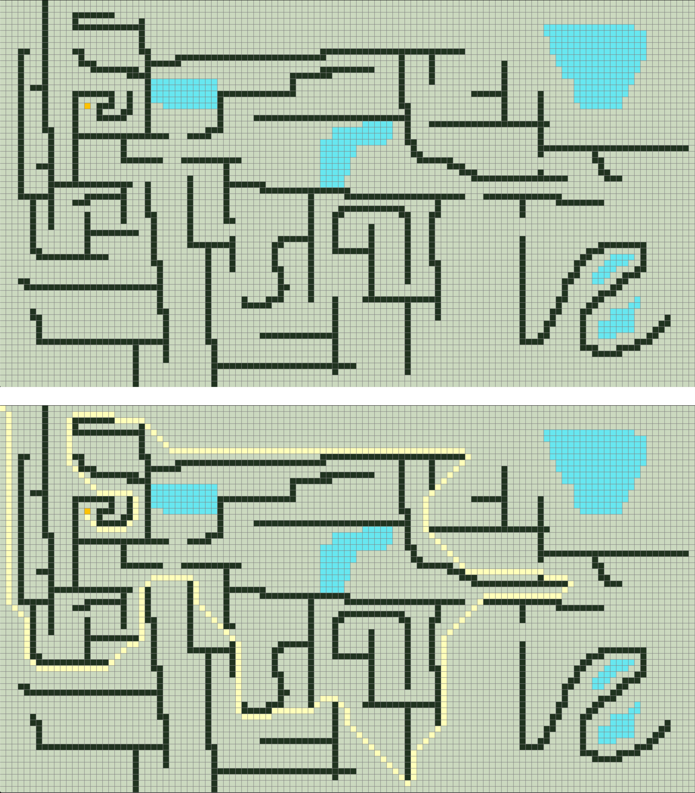

# A-star Pathfinding

“An application that uses the A-star search algorithm to solve a labyrinth drawn by the user”



## Installation and Run

macOS:

```sh
brew install python@3.8
pip3 install pygame==2.0.0.dev6
pip3 install numpy

cd src
python main.py 1920 1080 S
```
